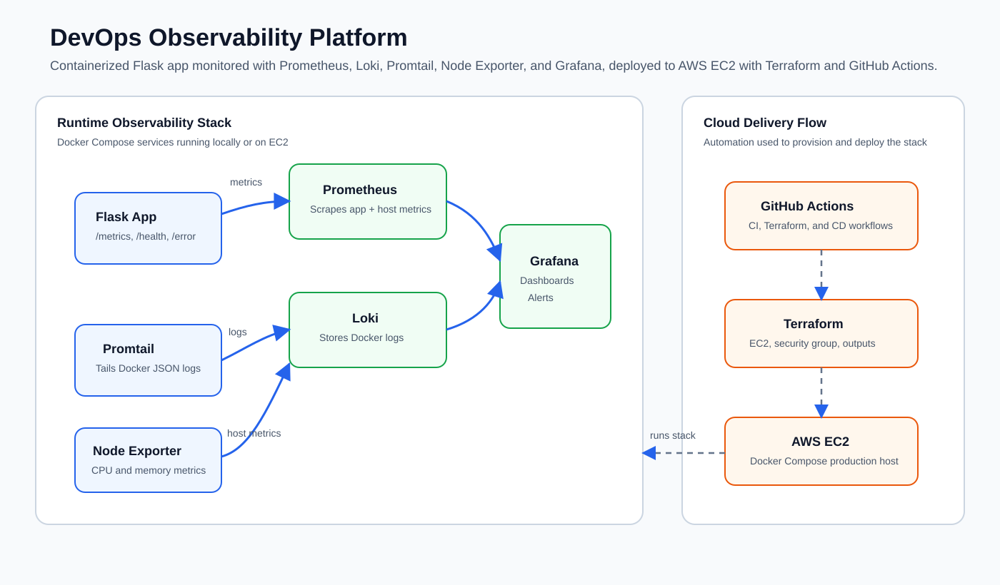
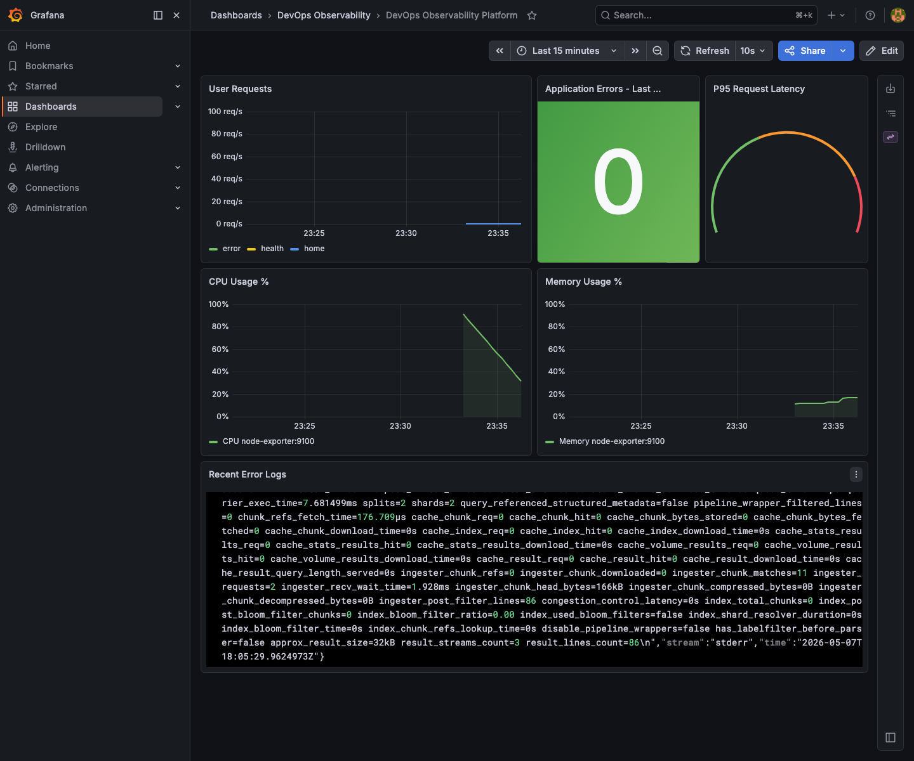
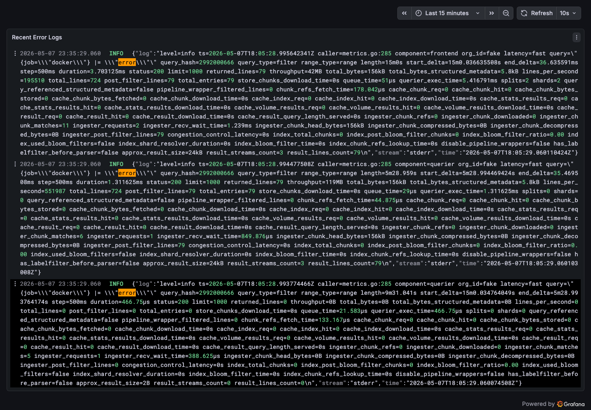
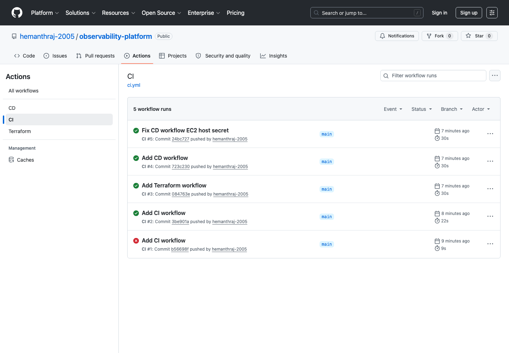

# DevOps Observability Platform

Production-style observability platform for a containerized Flask application. It shows metrics, logs, dashboards, alerts, infrastructure as code, and CI/CD in one compact DevOps project.

## Tech Stack

| Layer | Tools |
| --- | --- |
| Application | Flask, Python |
| Metrics | Prometheus, Node Exporter |
| Logs | Loki, Promtail |
| Visualization | Grafana |
| Orchestration | Docker Compose |
| Infrastructure | Terraform, AWS EC2 |
| CI/CD | GitHub Actions |

## Architecture



More details: [Architecture Walkthrough](docs/architecture.md)

## Key Features

- Flask app with `/health`, `/metrics`, and simulated `/error` endpoint.
- Custom Prometheus metrics for request count, latency, and errors.
- Node Exporter metrics for CPU and memory monitoring.
- Docker log aggregation using Promtail and Loki.
- Provisioned Grafana dashboard with metrics and error logs.
- Grafana alert rules for high error count and high CPU usage.
- Terraform-based AWS EC2 provisioning.
- GitHub Actions for CI, Terraform, and EC2 deployment.

## Screenshots

### Grafana Dashboard



### Error Logs in Grafana



### GitHub Actions



## Project Structure

```text
.
├── app/                    # Flask application and tests
├── grafana/                # Dashboards, datasources, alerts
├── logging/                # Loki and Promtail config
├── monitoring/prometheus/  # Prometheus scrape config
├── infra/                  # Terraform and EC2 deployment scripts
├── .github/workflows/      # CI, Terraform, and CD workflows
├── docs/                   # Architecture, screenshots, detailed notes
└── docker-compose.yml      # Local observability stack
```

Terraform details: [Terraform Folder Structure](docs/terraform-folder-structure.md)

## Run Locally

Start the stack:

```bash
docker compose up --build
```

Generate sample traffic:

```bash
curl http://localhost:5001/
curl http://localhost:5001/health
curl http://localhost:5001/error
```

Open Grafana:

```text
http://localhost:3005
```

Grafana login:

```text
username: admin
password: admin
```

## Services

| Service | URL |
| --- | --- |
| Flask App | http://localhost:5001 |
| Prometheus | http://localhost:9090 |
| Grafana | http://localhost:3005 |
| Node Exporter | http://localhost:9100 |
| Loki | http://localhost:3100 |

## CI/CD

| Workflow | Purpose |
| --- | --- |
| `ci.yml` | Tests, syntax checks, dashboard JSON validation, Compose validation, Docker build |
| `terraform.yml` | Manual Terraform plan/apply for AWS infrastructure |
| `cd.yml` | Syncs project to EC2 and deploys the Docker Compose stack |

Workflow files: [.github/workflows](.github/workflows)

## Interview Summary

Built a containerized observability platform with Flask, Prometheus, Grafana, Loki, Promtail, and Node Exporter to monitor application metrics, infrastructure usage, and Docker logs. Automated validation, infrastructure provisioning, and EC2 deployment using GitHub Actions and Terraform.

## Documentation

- [Architecture Walkthrough](docs/architecture.md)
- [Terraform Folder Structure](docs/terraform-folder-structure.md)
- [Detailed Project Feature Summary](docs/project-feature-summary.md)
