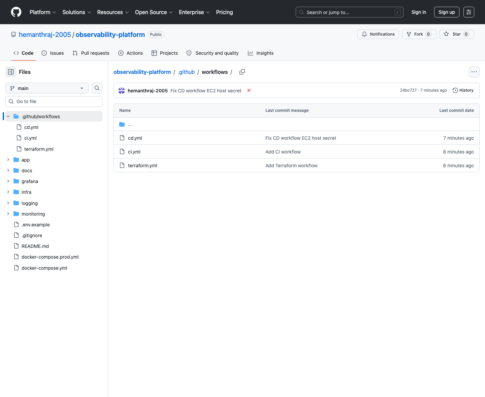

# DevOps Observability Platform

A production-style observability platform for containerized applications using **Docker Compose, Flask, Prometheus, Node Exporter, Loki, Promtail, Grafana, Terraform, AWS EC2, and GitHub Actions**.

This project is designed to be easy to explain in interviews: it has a clear architecture, real dashboards, centralized logs, custom application metrics, alert rules, infrastructure as code, and CI/CD automation.

## Architecture


Detailed architecture notes are available in [docs/architecture.md](docs/architecture.md).

## What This Project Demonstrates

| Area | Implementation |
| --- | --- |
| Application monitoring | Flask exposes custom Prometheus metrics for request count, latency, and simulated errors. |
| Infrastructure monitoring | Node Exporter exposes CPU and memory metrics to Prometheus. |
| Centralized logging | Promtail collects Docker logs and forwards them to Loki. |
| Visualization | Grafana is automatically provisioned with Prometheus and Loki datasources plus a dashboard. |
| Alerting | Grafana alert rules detect high Flask error count and high CPU usage. |
| Local orchestration | Docker Compose runs the full observability stack locally. |
| Cloud infrastructure | Terraform provisions an AWS EC2 host, security group, encrypted root volume, and public outputs. |
| CI/CD | GitHub Actions validates code/configuration and deploys the production Compose stack to EC2. |

## Dashboard Screenshots

### Grafana Dashboard


### Grafana Error Logs


### GitHub Actions Workflow


### Workflow Files



Workflow files are stored in [.github/workflows](.github/workflows).

## Services

| Service | Purpose | Local URL |
| --- | --- | --- |
| Flask App | Sample application with logs, health checks, errors, and Prometheus metrics | http://localhost:5001 |
| Prometheus | Time-series metrics collection and PromQL queries | http://localhost:9090 |
| Grafana | Dashboards for metrics, logs, and alerts | http://localhost:3005 |
| Node Exporter | Host/system metrics exporter | http://localhost:9100 |
| Loki | Centralized log storage and querying | http://localhost:3100 |
| Promtail | Docker log collector that forwards logs to Loki | Internal |

Grafana local login:

```text
username: admin
password: admin
```

## Application Endpoints

| Endpoint | Purpose |
| --- | --- |
| `/` | Returns application status and emits an info log. |
| `/health` | Returns `OK` for health checks. |
| `/error` | Generates a simulated HTTP 500 response and error log. |
| `/metrics` | Exposes Prometheus metrics. |

## Custom Metrics

| Metric | Type | Purpose |
| --- | --- | --- |
| `flask_http_requests_total` | Counter | Counts requests by method, endpoint, and HTTP status. |
| `flask_http_request_duration_seconds` | Histogram | Tracks request latency by method and endpoint. |
| `flask_http_errors_total` | Counter | Counts simulated application errors. |

Prometheus also scrapes:

- `prometheus:9090`
- `node-exporter:9100`
- `flask-app:5000/metrics`

## Grafana Dashboard Panels

| Panel | Purpose |
| --- | --- |
| User Requests | Shows request rate by Flask endpoint. |
| Application Errors - Last 5m | Shows recent simulated application failures. |
| P95 Request Latency | Shows 95th percentile request latency. |
| CPU Usage % | Shows host CPU usage from Node Exporter. |
| Memory Usage % | Shows host memory usage from Node Exporter. |
| Recent Error Logs | Shows Loki log lines containing `error`. |

## Alerts

| Alert | Trigger |
| --- | --- |
| Flask High Error Count | More than 5 Flask errors in 5 minutes. |
| Node High CPU Usage | CPU usage above 80% for 2 minutes. |

## Run Locally

Start the full stack:

```bash
docker compose up --build
```

Generate normal traffic:

```bash
curl http://localhost:5001/
curl http://localhost:5001/health
```

Generate an application error:

```bash
curl http://localhost:5001/error
```

Open Grafana:

```text
http://localhost:3005
```

Then go to:

```text
Dashboards > DevOps Observability > DevOps Observability Platform
```

## Terraform Folder Structure

Terraform files live in `infra/terraform` and deploy the AWS EC2 host used by the production stack.

```text
infra/
├── scripts/
│   ├── bootstrap-ec2.sh
│   └── deploy.sh
└── terraform/
    ├── versions.tf
    ├── variables.tf
    ├── main.tf
    ├── outputs.tf
    ├── terraform.tfvars.example
    └── .terraform.lock.hcl
```

More detail is available in [docs/terraform-folder-structure.md](docs/terraform-folder-structure.md).

Terraform provisions:

- EC2 instance
- Security group
- Encrypted EBS root volume
- Docker bootstrap through EC2 user data
- Public URLs for Flask, Grafana, and Prometheus

## GitHub Actions Workflows

| Workflow | Purpose |
| --- | --- |
| `.github/workflows/ci.yml` | Runs tests, validates syntax, validates dashboard JSON, validates Compose config, and builds the Flask image. |
| `.github/workflows/terraform.yml` | Manually runs Terraform plan/apply against AWS. |
| `.github/workflows/cd.yml` | Syncs the repository to EC2, writes production secrets, and runs Docker Compose. |

The CI workflow runs on every push and pull request to `main`.

Run the same core checks locally:

```bash
pip install -r app/requirements-dev.txt
cd app
pytest -q
cd ..
docker compose config
GRAFANA_ADMIN_PASSWORD=ci-test-password docker compose -f docker-compose.yml -f docker-compose.prod.yml config
docker build -t observability-platform-flask-app:ci ./app
```

## AWS Deployment

Create a Terraform variables file:

```bash
cd infra/terraform
cp terraform.tfvars.example terraform.tfvars
```

Edit `terraform.tfvars`:

```hcl
aws_region       = "ap-south-1"
key_name         = "your-existing-ec2-keypair"
allowed_ssh_cidr = "YOUR_PUBLIC_IP/32"
allowed_app_cidr = "YOUR_PUBLIC_IP/32"
```

Run Terraform locally:

```bash
terraform init
terraform validate
terraform plan
terraform apply
```

After Terraform creates the instance and Docker bootstrap finishes, run the CD workflow from GitHub Actions or push to `main`.

## GitHub Secrets

| Secret | Purpose |
| --- | --- |
| `AWS_ACCESS_KEY_ID` | AWS access key for Terraform. |
| `AWS_SECRET_ACCESS_KEY` | AWS secret key for Terraform. |
| `EC2_KEY_NAME` | Existing AWS EC2 key pair name. |
| `ALLOWED_SSH_CIDR` | CIDR allowed to SSH, for example `x.x.x.x/32`. |
| `ALLOWED_APP_CIDR` | CIDR allowed to reach Grafana, Prometheus, and Flask. |
| `EC2_HOST` | EC2 public IP or DNS after Terraform creates the host. |
| `EC2_USER` | SSH user, usually `ubuntu`. |
| `EC2_SSH_PRIVATE_KEY` | Private key matching the EC2 key pair. |
| `GRAFANA_ADMIN_USER` | Production Grafana admin username. |
| `GRAFANA_ADMIN_PASSWORD` | Production Grafana admin password. |

Optional GitHub variable:

| Variable | Purpose |
| --- | --- |
| `AWS_REGION` | AWS region, default is `ap-south-1`. |

## Useful PromQL Queries

Request rate:

```promql
sum by (endpoint) (rate(flask_http_requests_total[1m]))
```

Application errors in the last 5 minutes:

```promql
sum(increase(flask_http_errors_total[5m]))
```

P95 request latency:

```promql
histogram_quantile(0.95, sum(rate(flask_http_request_duration_seconds_bucket[5m])) by (le))
```

CPU usage:

```promql
100 - (avg by (instance) (rate(node_cpu_seconds_total{mode="idle"}[5m])) * 100)
```

Memory usage:

```promql
(1 - (node_memory_MemAvailable_bytes / node_memory_MemTotal_bytes)) * 100
```

## Useful LogQL Queries

All Docker logs:

```logql
{job="docker"}
```

Error logs:

```logql
{job="docker"} |= "error"
```

Flask access/error activity:

```logql
{job="docker"} |= "flask-app"
```

## Interview Summary

Built a containerized observability platform with Flask, Prometheus, Grafana, Loki, Promtail, and Node Exporter to monitor application metrics, infrastructure usage, and centralized Docker logs. Implemented custom Prometheus metrics, Grafana dashboards, alerting, Terraform-based AWS EC2 provisioning, and GitHub Actions CI/CD for validation and deployment.
